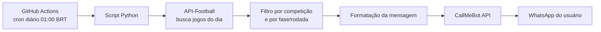

# ⚽ Football Match Notifier — Notificador de Jogos via WhatsApp

Automação serverless que consulta diariamente as principais ligas de futebol do mundo e envia um resumo formatado dos jogos do dia direto para o WhatsApp — sem servidor, sem custo, 100% automatizado via GitHub Actions.

```
⚽ Jogos de hoje (21/07/2026)

🏆 Brasileirão Série A
19:30 - Atlético-MG x Bahia

🏆 Sul-Americana
19:00 - Club Nacional x Tigre
21:30 - UCV x Santos

🏆 Champions League
16:00 - Real Madrid x Manchester City
```

## 🎯 Sobre o projeto

Acompanhar os horários de jogos espalhados por várias competições diferentes — nacionais, sul-americanas e europeias — normalmente exige checar múltiplos sites ou apps, todos os dias. Este projeto resolve isso na raiz: uma automação que roda sozinha, todos os dias, e entrega a informação já pronta e organizada onde o usuário já está — o WhatsApp.

O foco do projeto foi construir uma solução **enxuta e gratuita**: sem servidor dedicado, sem banco de dados, sem custo de infraestrutura — usando apenas serviços com tier gratuito e orquestração via CI/CD.

## 🧠 Arquitetura



## 🏆 Competições monitoradas

| Competição | País/Região |
|---|---|
| Brasileirão Série A | 🇧🇷 Brasil |
| Copa do Brasil | 🇧🇷 Brasil |
| Campeonato Paulista | 🇧🇷 Brasil |
| Copa Libertadores | 🌎 América do Sul |
| Copa Sul-Americana | 🌎 América do Sul |
| Premier League | 🏴󠁧󠁢󠁥󠁮󠁧󠁿 Inglaterra |
| La Liga | 🇪🇸 Espanha |
| Bundesliga | 🇩🇪 Alemanha |
| Ligue 1 | 🇫🇷 França |
| Serie A | 🇮🇹 Itália |
| UEFA Champions League | 🏆 Europa |

Apenas competições com jogo no dia aparecem na mensagem — o script não gera seções vazias.

## 🛠️ Stack técnica

| Camada | Tecnologia | Por quê |
|---|---|---|
| Linguagem | Python 3.12 | Simplicidade e legibilidade para scripts de integração de APIs |
| Fonte de dados | [API-Football](https://www.api-football.com/) | Cobertura ampla de competições em uma única API, com tier gratuito |
| Entrega | [CallMeBot](https://www.callmebot.com/) | API leve para envio de mensagens ao WhatsApp sem burocracia de aprovação comercial |
| Orquestração | GitHub Actions (cron) | Agendamento e execução sem necessidade de servidor ativo 24/7 |
| Segrects | GitHub Secrets | Armazenamento seguro de credenciais, com mascaramento automático em logs |

## 📁 Estrutura do repositório

```
.
├── .github/
│   └── workflows/
│       └── notificar-jogos.yml   # Agendamento (cron) e execução do workflow
├── notificar_jogos.py            # Script principal (busca, filtro, formatação e envio)
└── README.md
```

## ⚙️ Como rodar / configurar

1. Crie uma conta gratuita na [API-Football](https://www.api-football.com/) e gere sua API Key.
2. Ative o CallMeBot no seu WhatsApp:
   - Adicione o contato `+34 611 01 16 37`
   - Envie a mensagem `I allow callmebot to send me messages`
   - Guarde a apikey retornada na resposta
3. No repositório, configure os *Secrets* (`Settings → Secrets and variables → Actions`):

   | Secret | Descrição |
   |---|---|
   | `API_FOOTBALL_KEY` | Chave de API da API-Football |
   | `CALLMEBOT_PHONE` | Número de WhatsApp com DDI, apenas números |
   | `CALLMEBOT_APIKEY` | Apikey gerada na ativação do CallMeBot |

4. O workflow já roda automaticamente todos os dias às 01:00 (horário de Brasília). Para testar sem esperar o agendamento, use o botão **Run workflow** na aba **Actions**.

## 👤 Autor

Projeto desenvolvido como automação pessoal, combinando APIs públicas gratuitas, boas práticas de segurança de credenciais e CI/CD para resolver um problema real do dia a dia.
